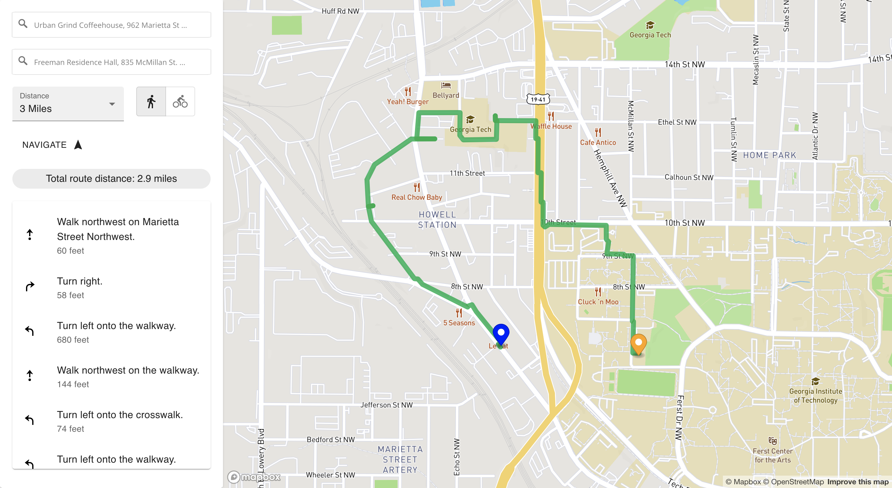

# Route-About

A navigation web app to help users plan walking/cycling routes based on distance. It offers 1) both point-to-point and round-trip navigation, 2) numerous randomized routes based on desired start & end, distance, and means of transportation, 3) route visualization on map, and 4) detailed instructions.

## Inspiration

During COVID, I tried to stay active by walking around campus everyday. As time goes by, however, the normal routes that I took became repetitive and unexciting. Therefore, I wished there was an app that could help me find new routes. This would help me be more excited for my walks and explore my surroundings. Plus, I would be able to walk anytime and anywhere I want to.

## User Stories

- "I live in an urban area with no access to parks. I want to find walking paths from and to my house to walk my dog."
- "COVID and remote work stranded me to my chair for most of my day. I just moved to this area, so I want to find cycling routes so I can be more active."
- "I walk to work everyday. I want to find a non-direct route so I can attain more footsteps."

## Background Technologies

- React.js
- Mapbox GL JS
- Mapbox Directions API

## Set Up Guide

### `npm start`

Runs the app in the development mode.\
Open [http://localhost:3000](http://localhost:3000) to view it in your browser.

The page will reload when you make changes.\
You may also see any lint errors in the console.

## App Mock-Up

